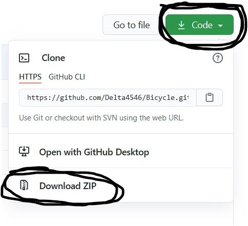

# Gino Bartali

<p>website project for school https://delta4546.github.io/Gino_Bartali/</p>
## How To Use 🤔

It is extremely easy to install this project:

```
# Download Files
# Extract All Files and open ZIP files
# Click on index.html to show the website on your favorite browser 
# for show/edit the code it's very simply you do drag and drop the file 
on your favorite code editor (for example : sublime text,visual studio code, atom, notepad ++ etc..)

# Enjoy it 🎉
```



<p>/!\warning the website is not responsive because I'm lazy</p>


